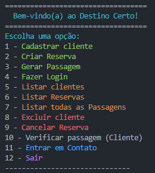

## 🖥️ Projeto
Esse é um projeto Back-end que criei para a Recode Pro.  
OBS: Utilize o VS Code para melhor visualização da aplicação no terminal. 😁

## 🚀 Tecnologias
Esse projeto foi desenvolvido com as seguintes tecnologias:

- Java
- MySQL 
- JDBC
- Git e GitHub

## 🛠️ Features

- Cadastro de Cliente
  - Cadastra um novo usuário (nome, email, senha e telefone);
- Criação de Reservas
    - Apenas um usuário existente consegue criar uma reserva.
    - É necessário fazer Login antes.
- Geração de Passagens
    - Só consegue gerar uma passagem, se a reserva existir. 
- Login
    - Pede o e-mail e senha já cadastrados.
- Listar Clientes
    - Mostra a lista de todos os clientes cadastrados.
- Listar Reservas
    - Mostra a lista com todas as Reservas.
- Listar Passagens
    - Mostra a lista com todas as Passagens.
- Excluir Clientes
    - Caso o Cliente tenha reservas, ele não poderá ser excluído.
- Cancelar Reservas
- Verificar Passagem (Cliente)
    - Após logar e gerar passagem, o cliente pode visualizar.
    - Caso o cliente não tenha passagem, ele informa que não possui.
- Enviar Mensagem

## 🏷️ Layout

Repositório [Front-end](https://github.com/PatsFerrer/recode-projeto).
Você pode visualizar o site através
[desse link](https://patsferrer.github.io/recode-projeto/site/index.html).
